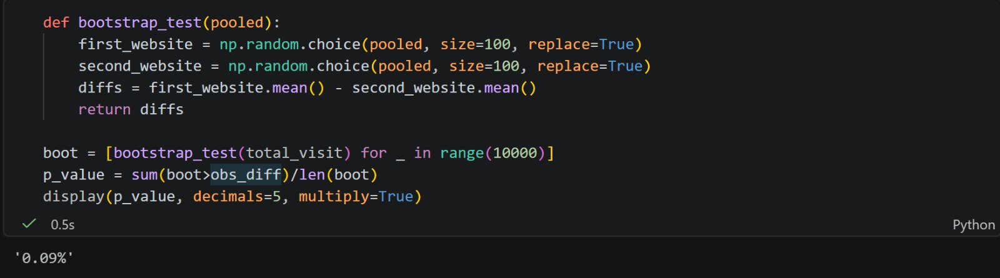

#                                               Percentify
[](https://pepy.tech/projects/percentify)

[](https://pepy.tech/project/percentify)

[](https://pypi.org/project/percentify/)
[](https://pypi.org/project/percentify/)
[](LICENSE)
[](https://github.com/data-centt/percentify/actions/workflows/python-app.yml)

**Percentify** is a one import, one line code, that covers all stats you need for your data analysis and codebase.

Stop digging through scipy, statsmodels, and sklearn for operations you run every day. Percentify surfaces the most common percentage and statistical calculations into simple, readable function calls.


---

## 📦 Installation
```
pip install percentify
```

---

## ✨ Core Percentage Toolkit

### `percent`: Part of a Whole
```python
from percentify import percent

percent(50, 200)          # → 25.0
percent(1, 3)             # → 33.33
percent(5, 0)             # → 0.0  (safe division by zero)
```

### `change`: Percentage Increase or Decrease
```python
from percentify import change

change(100, 150)  # → 50.0   (50% increase)
change(200, 150)  # → -25.0  (25% decrease)
```

### `difference`: Difference Between Two Values
```python
from percentify import difference

difference(10, 20)  # → 66.67
difference(50, 50)  # → 0.0
```

### `split`: Split a Total by Weights
```python
from percentify import split

split(200, [1, 3])       # → [50.0, 150.0]
split(100, [1, 1, 1])    # → [33.33, 33.33, 33.33]
```

### `display`: Format as a String
```python
from percentify import display

display(25.0)                         # → "25.0%"
display(0.45, multiply=True)          # → "45.0%"
display(change(100, 20))              # → "-80.0%"
```

### Example Use Case



---

## 📊 Beyond Percentages; Data Science & Analytics

The functions below replace multi-step, hard-to-remember imports from scipy, statsmodels, and sklearn with a single line.

### `vif`: Variance Inflation Factor (MultiCollinearity)
Currently buried in `statsmodels.stats.outliers_influence`. One line instead of six.
```python
from percentify import vif

vif(df)
# → {"age": 1.2, "income": 8.4, "debt": 7.9}

vif(df, flag=5.0)
# → only columns with VIF > 5 (multicollinearity warnings)
```

### `missing`: Easy Missing Data Profiling
No more typing `df.isnull().sum() / len(df) * 100` every time.
```python
from percentify import missing

missing(df)
# → {"salary": 12.4, "age": 3.1, "name": 0.0}
```

### `cv`:  Coefficient of Variation
Not built-in anywhere — one line instead of `df.std() / df.mean() * 100`.
```python
from percentify import cv

cv(df["salary"])  # → 34.2
cv(df)            # → all numeric columns at once
```

### `outliers`: Percentage of Outliers (IQR Method)
Stop rewriting the IQR calculation from scratch.
```python
from percentify import outliers

outliers(df["salary"])  # → 4.7
outliers(df)            # → all numeric columns
```

### `r_squared`: R-Squared
```python
from percentify import r_squared

r_squared(y_true, y_pred)  # → 87.3
```

### `variance_explained`: PCA Variance Breakdown
```python
from percentify import variance_explained

variance_explained(df)
# → {"PC1": 45.2, "PC2": 23.1, "PC3": 12.8}
```

---

## 🤝 Contributing

Contributions are welcome!
- If you have an idea (extra helpers, bug fixes or an idea):
- Fork this repo
- Create a branch
- Commit your changes
- Open a pull request

I try to keep it within scope, to discuss big new features first.
